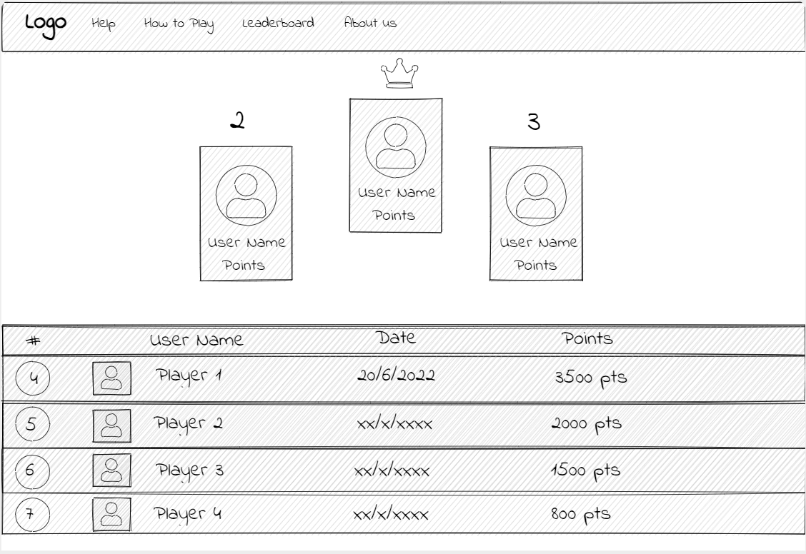
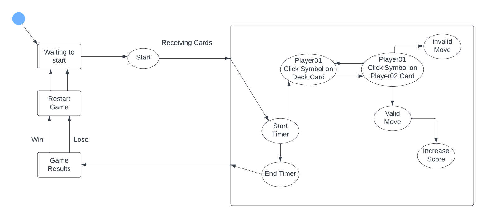

## <h1 style='background:#a2f5e9; border:0; color:black'>
 Mapa del Sitio 
</h1>

## <h1 style='background:#e0c8fa; border:0; color:black'>
 Sketches 
</h1>

## Home Page

## Help and How to play

## Waiting Room

## Game Room

## Leaderboard

## About Us

## <h1 style='background:#a2f5e9; border:0; color:black'>
 Discusión del grupo 
</h1>

Al discutir el sketch del Home Page, hemos decidido agregar un texto introductorio sobre el juego, después del título de la página. Así mismo, la página de ayuda se decidio dividir en dos, una de ayuda tipo soporte y otra donde se muestra un video de como jugar. Cabe mencionar que, las demás páginas mantienen su diseño inicial para los wireframes.

El diseño del home se ha mantenido simple y de forma intuitiva para regidirirse a las demás páginas, esto con el fin de simplificar el uso que le da el usuario. Así mismo, la página de ayuda se mantiene como un formulario, donde se envian los problemas que tiene el usuario al correo de soporte, con el fin de atender issues personalizados. Por otro lado, para el how to play decidimos agregar un video para simplicar la comprensión de la adaptación del juego.

## <h1 style='background:#e0c8fa; border:0; color:black'>
 Wireframes 
</h1>

## Home Page

## Help

## How to play

## Waiting Room

## Game Room

## Leaderboard

## About Us

## <h1 style='background:#a2f5e9; border:0; color:black'>
 Paleta de colores 
</h1>

La paleta fue generada por https://coolors.co/. La misma referente a los colores del juego físico.

Para obtenerla se introdujo una imagen del juego y las cartas a la herramienta. La cual genera una variedad de paletas uniformes a partir de la (as) imagen subida. Esta paleta fue elegida debido a que era la que nos transmitía la mejor combinación para un sitio relacionado al juego de Spot It.

## <h1 style='background:#e0c8fa; border:0; color:black'>
 Máquina de Estados 
</h1>

